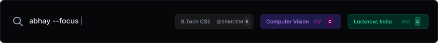
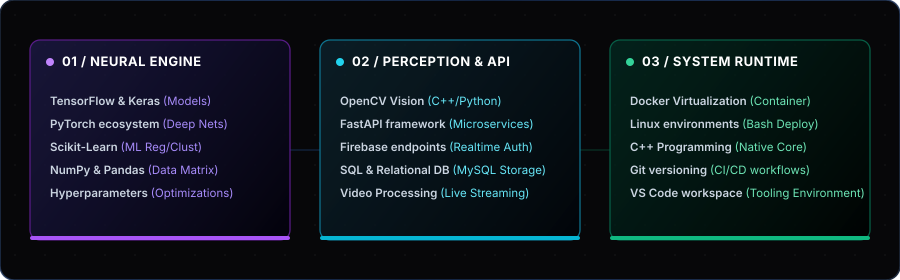
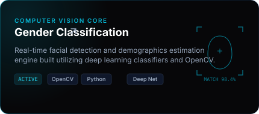
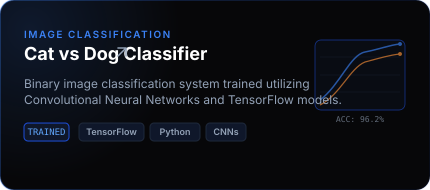
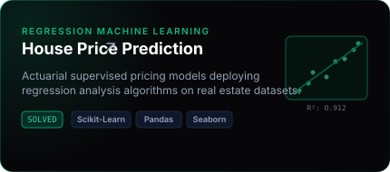
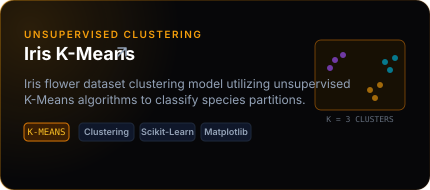
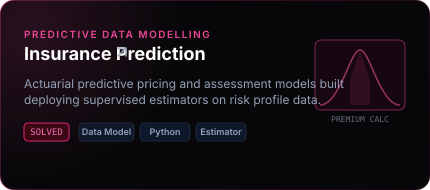

<!--
✨ HANDCRAFTED 2026 GITHUB PROFILE LANDING PAGE
🎨 DESIGN LANGUAGE: VERCEL × LINEAR × APPLE
🦾 DEVELOPER: ABHAY SHANKER TIWARI
-->

  <!-- Glowing Interactive Tech Banner -->
  

    

  <!-- Interactive Typing Animation -->
  

   

  <!-- Raycast-Style Quick Info Bar -->
  

    

  <!-- Stats view counts -->
  

    

  <!-- Social Link Buttons -->
  

    
    
    
    
    
  

---

## 💎 Executive Summary

<table width="100%" border="0" cellpadding="0" cellspacing="0">
  <tr>
    <td width="58%" valign="top">
      
I am <b>Abhay Shanker Tiwari</b>, a dedicated AI/ML engineer focused on building robust Computer Vision architectures and scalable deep neural networks.

      
My academic foundation in Computer Science at SRMCEM drives me to engineer real-world systems, specializing in biometric identity platforms, real-time video perception, and optimization for low-latency client environments.

      <ul>
        <li>🧬 <b>Neural Architecture:</b> Training custom models via PyTorch, TensorFlow, and optimizing weight pipelines.</li>
        <li>📷 <b>Computer Vision:</b> Object detection, face mesh tracking, segmentation, and live OpenCV pipelines.</li>
        <li>🌐 <b>API Backends:</b> Connecting ML models to high-frequency endpoints with FastAPI and secure architectures.</li>
      </ul>
    </td>
    <td width="4%"></td>
    <td width="38%" valign="top">
      

<pre lang="yaml" style="background: #070709; border: 1px solid #1e293b; padding: 16px; border-radius: 8px; font-size: 12px; color: #a78bfa; text-align: left; margin: 0; line-height: 1.6;">
<b>developer_profile:</b>
  name: "Abhay Shanker Tiwari"
  location: "Lucknow, India"
  education: "B.Tech CSE @ SRMCEM"
  core_stack:
    - Python [Primary]
    - PyTorch / TensorFlow
    - OpenCV [C++ / Python]
    - FastAPI / SQL
  focus_areas:
    - Artificial Intelligence
    - Computer Vision
    - Model Deployment
</pre>
      

    </td>
  </tr>
</table>

---

## 🛠️ Infrastructure & Tech Stack Console

This console maps out the technology domains I configure to construct end-to-end machine learning infrastructure.

  
  
    
  
  

---

## 🚀 Curation of Featured AI / ML Projects

These production-grade architectures demonstrate my implementation work in computer vision, statistical modeling, and deep classifier networks.

<!-- Glassmorphism Cards Grid Table -->
<table width="100%" border="0" cellpadding="0" cellspacing="10" style="border-collapse: separate; border-spacing: 10px;">
<tr>
<!-- Project Card 1: AscendID -->
<td width="50%" valign="top">

</td>
<!-- Project Card 2: Gender Classification -->
<td width="50%" valign="top">

</td>
</tr>
<tr>
<!-- Project Card 3: Cat vs Dog Classifier -->
<td width="50%" valign="top">

</td>
<!-- Project Card 4: House Price Prediction -->
<td width="50%" valign="top">

</td>
</tr>
<tr>
<!-- Project Card 5: Iris K-Means -->
<td width="50%" valign="top">

</td>
<!-- Project Card 6: Insurance Prediction -->
<td width="50%" valign="top">

</td>
</tr>
</table>

---

## 📊 Analytics Workspace

A synchronized aggregation of coding activities and repository statistics across my GitHub profile.

  <!-- Stats Card -->
  
  &nbsp;&nbsp;
  <!-- Languages Card -->
  

  <!-- Streak Card -->
  

  <!-- Activity Graph -->
  

 

  <!-- Trophy Showcase -->
  

---

## ⚡ Active Horizon & Systems CLI

Interactive console outputs displaying my current research roadmap, targets for 2026, and developmental trivia.

<pre>
$ abhay --init
Initializing neural workspace ... [OK]
Loading metrics parameters ... [OK]

$ abhay --query --stack --active
{
  "focus_learning": [
    "Advanced Deep Learning: Multi-modal models and Transformer blocks",
    "Generative AI & LLMs: Latent diffusion models and fine-tuning configurations",
    "High-Frequency Backends: Deploying FastAPI systems inside Docker containers",
    "Compiling native OpenCV bindings inside optimized C++ algorithms"
  ],
  "milestones_2026": [
    "🎯 Deploy 3 production-ready neural networks to public cloud endpoints",
    "🏆 Win upcoming regional and national engineering hackathons",
    "🤝 Contribute core code to open-source deep learning repositories",
    "💼 Secure a focused industrial machine learning or computer vision internship"
  ]
}

$ abhay --trivia --verbose
&gt; Prototyping complex neural structures from absolute scratch is my primary workflow.
&gt; Strong advocate of visual computing models addressing immediate real-world use-cases.
&gt; peak compiling efficiency occurs inside late-night programming blocks.
&gt; Space Grotesk is configured as my primary interface typeface.
</pre>

---

## 🐍 Interactive Activity Snake

A background workflow checks in daily to generate a dynamic crawler parsing my contributions matrix:

  

> [!TIP]
> ### How to set this up on your profile repository:
> 1. Create a workspace action file: `.github/workflows/snake.yml`
> 2. Implement the **Platane/snk** runner.
> 3. Configure it to output to a branch (`output`) or directly check in your SVG asset.

---

## 📫 Let's Connect!

I am always open to discussing model optimizations, hardware-accelerated computer vision, backend integrations, or potential hackathon collaborations.

- **LinkedIn Platform:** [Abhay Shanker Tiwari](https://www.linkedin.com/in/abhay-shanker-tiwari-0a8031213/)
- **X Profile:** [@mr_graciz](https://x.com/mr_graciz)
- **Direct Mail:** *Reach out via LinkedIn or X direct message for secure inquiries.*

   
  <!-- Hidden backup snake asset for caching validation -->
  
  

    Handcrafted with ❤️ &amp; SVG Vectors. Inspired by Vercel Design Language. 
    &copy; 2026 Abhay Shanker Tiwari. All Rights Reserved.
  

